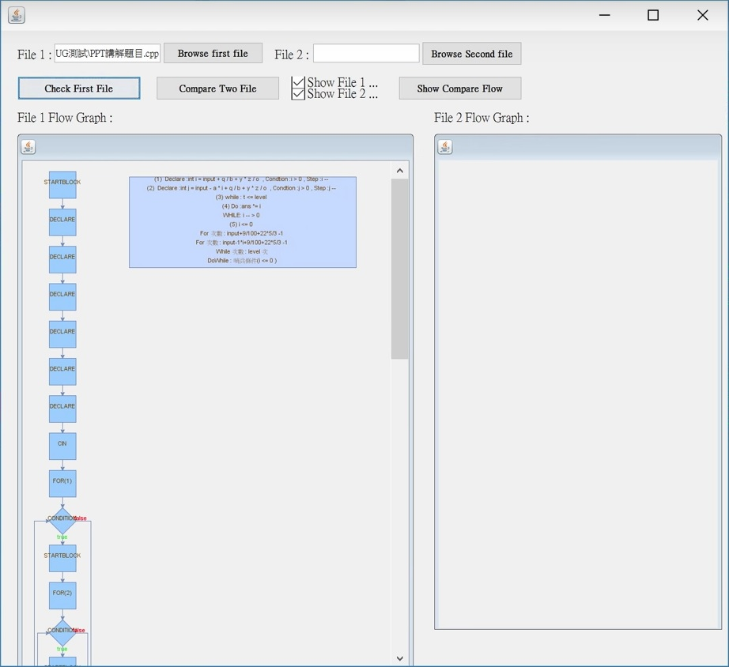
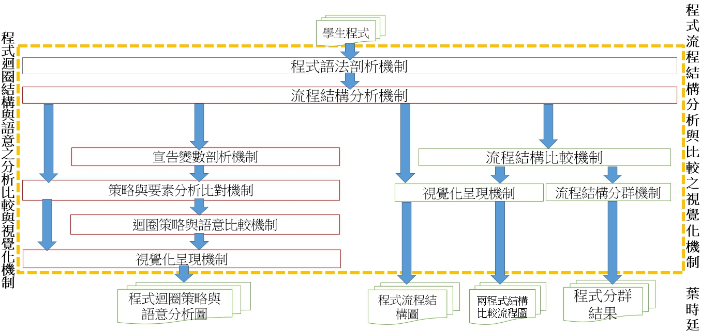

# 
程式迴圈結構與語意之分析比較與視覺化機制

        

        次系統研發主要研發「程式迴圈結構與語意之分析比較與視覺化機制」， 
        主要是使用ANTLR所剖析出的BNF規則剖析樹所剖析的迴圈程式碼語意資料， 
        將資料利用迴圈語意分析機制來分析迴圈的使用策略、迴圈的執行次數， 
        並且使用分析出來的策略與語意來和學生之間或是和老師之間比較， 
        藉由比較了解不同策略的程式碼之間的差異， 
        最後將結果以視覺化方式呈現給學生及教師。
        

## CodeAssessmentSystem UI介面

## 系統流程設計

